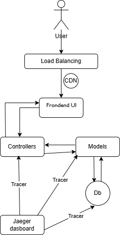
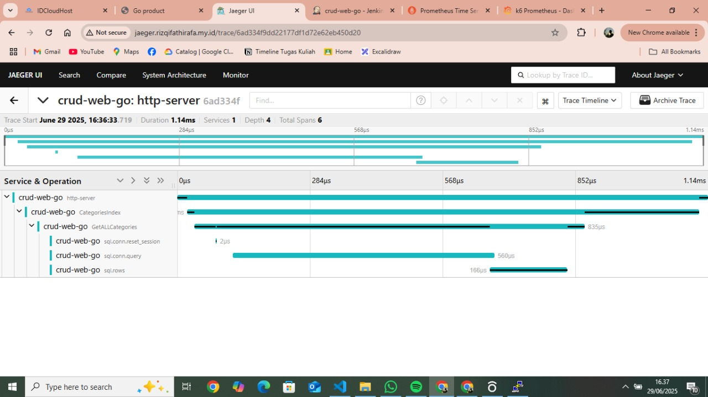
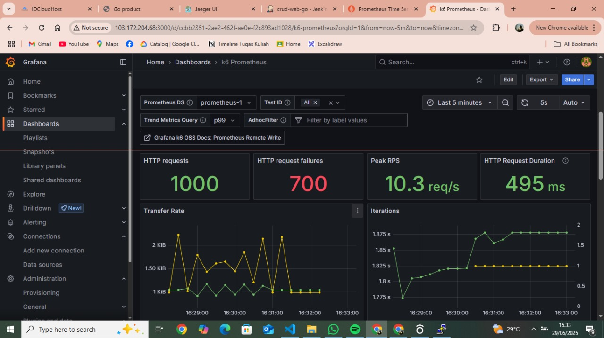
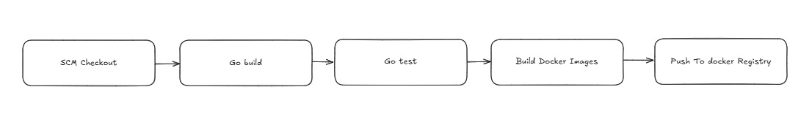
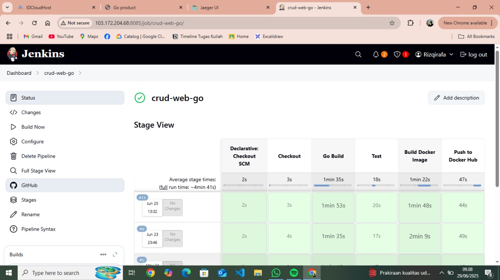

# Go CRUD Web Application

A robust, scalable CRUD web application built with **Go** and **PostgreSQL**, architected using the **MVC** pattern, and designed with performance, observability, and deployment in mind.

---

## 🚀 Features

- **MVC Architecture**: Clean separation between models, views (frontend), and controllers.
- **PostgreSQL**: Relational database with strong consistency.
- **Redis**: Used for caching and token storage.
- **JWT Authentication**: Secure and stateless API token authentication.
- **Jaeger Tracing**: Distributed tracing for observability and debugging.
- **Grafana + Prometheus Metrics**: Real-time performance visualization.
- **Load Testing**: Simulated with K6 for API stress testing.
- **Load Balancer (Nginx)**: Traffic distributed across instances.
- **Dockerized**: Fully containerized for consistent environments.
- **CI/CD Pipeline**: Simple Jenkins-based pipeline for build, test, and deploy.
- **CDN Support**: Optimized static content delivery.

---

## 🧱 System Architecture

### 👤 User
The end user interacts with the system via a web browser through the **frontend interface**.

---

### 🌐 Load Balancer (Nginx) + CDN
- **Nginx** acts as a reverse proxy and load balancer, distributing incoming traffic to multiple backend instances.
- **CDN** helps deliver static frontend assets (CSS, JS, images) efficiently across the globe.

---

### 🎨 Frontend (View Layer)
- The **View** in MVC, responsible for presenting data to the user.
- Can be a simple HTML template rendered by Go or a fully separate frontend app (e.g., React, Vue).
- Sends HTTP requests to the backend and renders responses.

---

###  ⚙️ Controllers (Application Logic)
- Core **request handlers** that receive API calls from the frontend.
- Manage business logic, process input, and coordinate with models.
- Return processed data or error responses back to the frontend.

---

### 🧠 Models (Data Layer)
- Represent the application's data structures and database operations.
- Responsible for executing queries, interacting with the **PostgreSQL** database, and applying validation.
- Typically use SQL drivers like `pgx` or ORMs like `GORM`.

---

### 🗄️ PostgreSQL (Database)
- Primary relational data store.
- Stores persistent application data (users, records, etc).
- Accessed directly by the **model layer**.

---

### 📊 Observability (Jaeger Tracing)
- Every request through Controller → Model → Database is traced using **Jaeger**.
- Helps diagnose latency issues, bottlenecks, and visualize request paths across services.
- All service layers generate **trace spans** that are aggregated in the Jaeger UI.

---

### 🔄 Tracing Flow

[Frontend Request]
      ↓
[Controller] -- trace --> Jaeger
      ↓
[Model]     -- trace --> Jaeger
      ↓
[PostgreSQL] -- trace --> Jaeger

## 🔍 Distributed Tracing with Jaeger

This project integrates **Jaeger** for distributed tracing. The screenshot below shows a trace of an HTTP request handled by the service `crud-web-go`, specifically the `GetAllCategories` operation.

🌐 URL : http://jaeger.rizqifathirafa.my.id/search

### 📈 Trace Overview

- **Trace Duration**: `1.14ms`
- **Service**: `crud-web-go`
- **Operation**: `GetAllCategories`
- **Span Depth**: 4 levels
- **Total Spans**: 6

### 🧬 Span Breakdown

The trace consists of the following span hierarchy:

### 📊 Load Test Result (Visualized on Grafana)

### 📌 Key Metrics Observed

| Metric                  | Value             | Description                                          |
|------------------------|-------------------|------------------------------------------------------|
| HTTP Requests          | `1000`            | Total requests sent to the endpoint.                |
| HTTP Request Failures  | `700`             | Total failed login requests.                        |
| Peak RPS               | `10.3 req/s`      | Max requests per second reached during test.        |
| Avg Request Duration   | `495 ms`          | Average duration per HTTP request.                  |

### 📈 Performance Insights

- **High Failure Rate (70%)**: Indicates potential issues with authentication logic or server resource limits under load.
- **Sustainable RPS**: The application handled up to 10.3 requests/sec before failures spiked.
- **Response Time**: Still under 500ms, which is within acceptable latency for most login APIs.

### ✅ Monitoring Stack

- **K6**: Load generation
- **Prometheus**: Time-series metrics collection
- **Grafana**: Metrics visualization dashboard

## 🔄 CI/CD Pipeline with Jenkins

### 📋 Pipeline Flow

The following is the CI/CD pipeline flow used in this project:

1. **SCM Checkout** – Clones the repository from the source control (e.g., GitHub)
2. **Go Build** – Compiles the Go source code into a binary
3. **Go Test** – Runs unit tests to ensure the application works correctly
4. **Build Docker Image** – Creates a Docker image from the application
5. **Push to Docker Hub** – Uploads the Docker image to the Docker registry

---

### 🛠️ Jenkins Pipeline Execution

Each stage is executed sequentially and displayed in Jenkins’ visual interface (Stage View), allowing real-time process monitoring.

- **Total average pipeline duration**: ~4 minutes 41 seconds
- **Average duration per stage**:
  - SCM Checkout: 2 seconds
  - Checkout: 3 seconds
  - Go Build: 1 minute 35 seconds
  - Go Test: 18 seconds
  - Build Docker Image: 1 minute 22 seconds
  - Push to Docker Hub: 47 seconds

> 💡 With Jenkins, the CI/CD process becomes automated and reliable for every code change.

---

### 📷 Visuals

## 📦 Conclusion

This project demonstrates a complete and modern approach to building a scalable CRUD web application using **Go** and **PostgreSQL**, equipped with powerful tools for **observability**, **performance monitoring**, and **continuous delivery**.

With features like distributed tracing, real-time dashboards, and automated CI/CD workflows, the application is well-suited for production environments that require speed, reliability, and maintainability.

Feel free to fork, clone, and contribute!

---

## 🤝 Connect with Me

If you have questions, feedback, or would like to collaborate, don't hesitate to reach out through the following platforms:

- 📧 Email: [rizqirafa45@gmail.com](mailto:rizqifathirafa45@gmail.com)
- 💼 LinkedIn: [linkedin.com/in/rizqifathirafa](https://www.linkedin.com/in/rizqifathirafa/)
- 🌐 Personal Website/Portfolio: [rizqifathirafa.my.id](http://rizqifathirafa.my.id)

---

⭐️ *Thank you for reading! If you find this project helpful, consider giving it a star on GitHub.*

